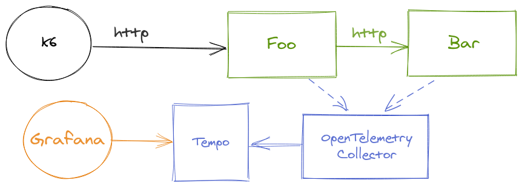
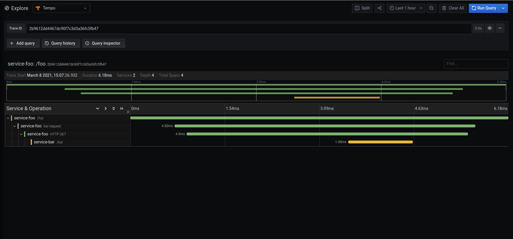

## foobar

This is a distributed tracing demo! Foobar consists of two **extremely** complex services: foo and bar.

On this demo:
- You can generate load with k6.
- Services foo and bar:
  - Are written in Python.
  - Are instrumented with OpenTelemetry.
  - Export the spans to an OpenTelemetry Collector using the OTLP exporter.
- The OpenTelemetry Collector exports the tracing data to Grafana Tempo.
- Grafana Tempo can be queried from Grafana.

Here's a small diagram:
<p align="center">

</p>

## QuickStart

Requirements: Docker and Docker Compose.

1. Build and run services with docker-compose:
```
docker-compose up --build -d 
```

2. See running services with:
```
docker-compose ps
```

3. Generate some load with k6:
```
docker run -i --network=foobar-demo_default loadimpact/k6 run --quiet - <example.js
```

4. See logs with:
```
docker-compose logs foo | grep trace_id
```

5. Pick a `trace_id` from the logs.

6. Go to Grafana (http://localhost:3000) -> Explore -> Tempo and paste the `trace_id`.
<p align="center">

</p>

7. Stop the whole setup with:
```
docker-compose stop
```

